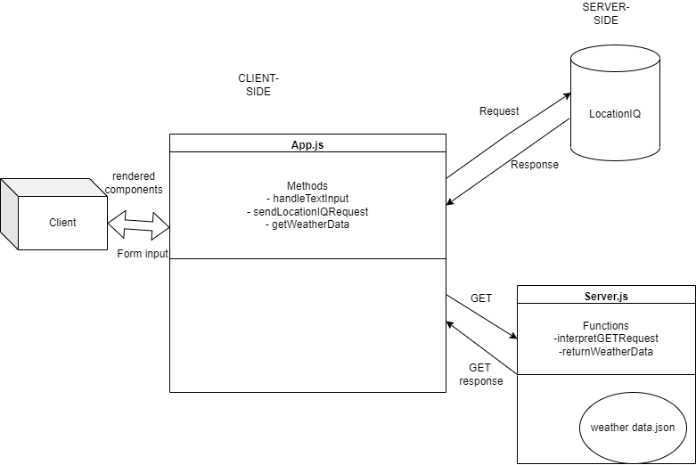
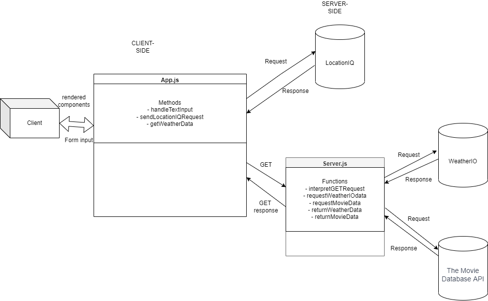
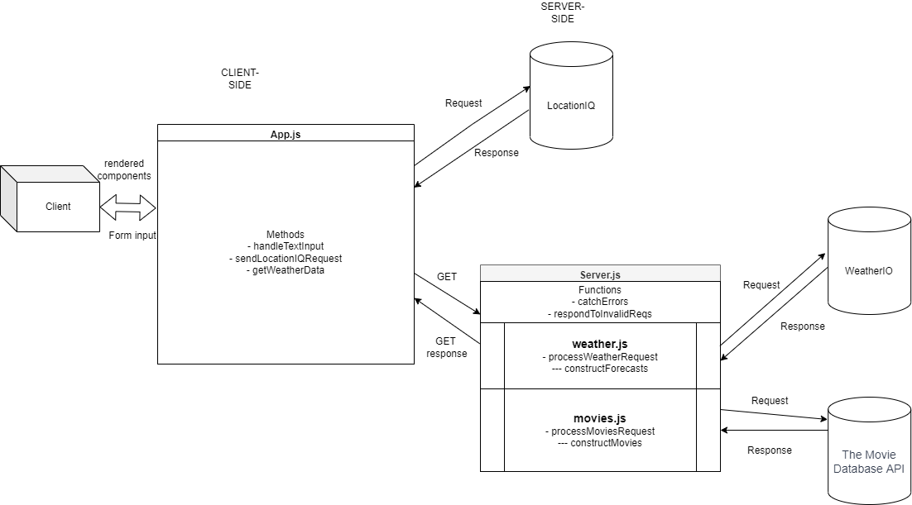
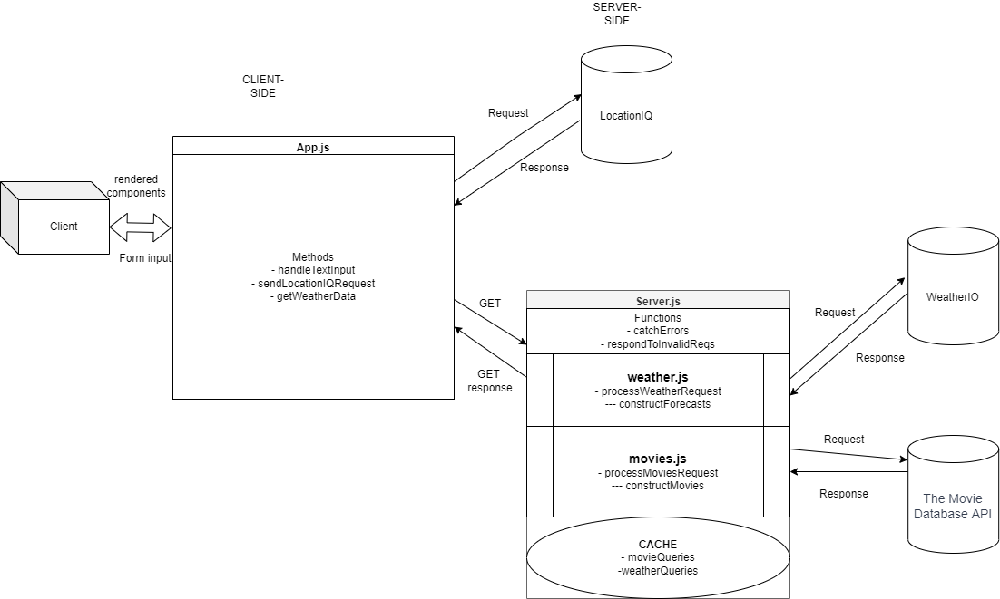

# City Explorer API

API for City Explorer app

**Author**: Jeffrey Jenkins
**Version**: 1.3.0

## Overview

This application shows data on location which the user has searched for, including a rendered map of the location, a weather forecast, and movies which are are related to the location.

## Getting Started
<!-- What are the steps that a user must take in order to build this app on their own machine and get it running? -->

## Architecture
<!-- Provide a detailed description of the application design. What technologies (languages, libraries, etc) you're using, and any other relevant design information. -->

## Change Log
<!-- Use this area to document the iterative changes made to your application as each feature is successfully implemented. Use time stamps. Here's an example:

01-01-2001 4:59pm - Application now has a fully-functional express server, with a GET route for the location resource. -->

## Credit and Collaborations

- Used this [stackoverflow thread](https://stackoverflow.com/questions/35864088/how-to-send-error-http-response-in-express-node-js) to create error response.

## Web Request Diagrams

### Lab 06: Co-authored with Matt Rangel

### Lab 07: Co-authored with Dan Brian

### Lab 08: An iteration on the Lab 07 diagram, co-authored with Nicholas Mercado

The Lab 07 diagram was used with Dan Brain's permission.

### Lab 09: An iteration on the Lab 08 diagram, co-authored with Brady Camp

Server JS's functions have been broken up into modules.

### Lab 10: An iteration on the Lab 09 diagram, co-authored with Liesl White

## Test estimates

### Time Estimates

### Lab 07 time estimates

1. **Feature #1: Setup**
    - Estimate of time needed to complete: 20 minutes
    - Start time: 10:30 PM
    - Finish time: 10:45 PM
    - Actual time needed to complete: 15 minutes
2. **Feature #2: Weather (placeholder)**
    - Estimate of time needed to complete: 30 minutes
    - Start time: 10:45 PM
    - Finish time: 11:40 PM
    - Actual time needed to complete: 55 minutes
3. **Feature 3: Error (revisited)**
    - Estimate of time needed to complete: 30 minutes
    - Start time: 11:40 PM
    - Finish time: 12:59 PM
    - Actual time needed to complete: 45 minutes

### Lab 08 time estimates

1. **Feature #1: Weather (live)**
    - Estimate of time needed to complete: 60 minutes
    - Start time: 6:00 PM
    - Finish time: 8:25 PM
    - Actual time needed to complete: 100 minutes
2. **Feature #2: Movies**
    - Estimate of time needed to complete: 30 minutes
    - Start time: 8:30 PM
    - Finish time: 11:19 PM
    - Actual time needed to complete: 154 minutes
3. **Feature #3: Publish**
    - Estimate of time needed to complete: 30 minutes
    - Start time: 11:23 PM
    - Finish time: 11:50 PM
    - Actual time needed to complete: 27 minutes

### Lab 09 time estimates

1. **Feature #1: Modularize Back-end**
    - Estimate of time needed to complete: 60 minutes
    - Start time: 10:54 AM
    - Finish time: 12:06 PM
    - Actual time needed to complete: 68 minutes

### Lab 10 time estimates

1. **Feature #1: Performance**
    - Estimate of time needed to complete: 90 minutes
    - Start time: 2:40 PM
    - Finish time: 3:50 PM
    - Actual time needed to complete: 70 minutes
